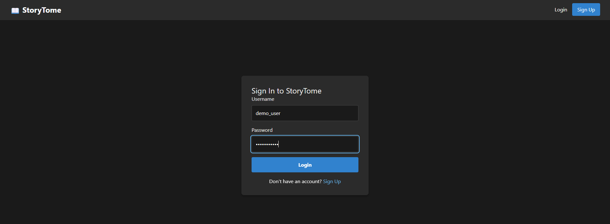
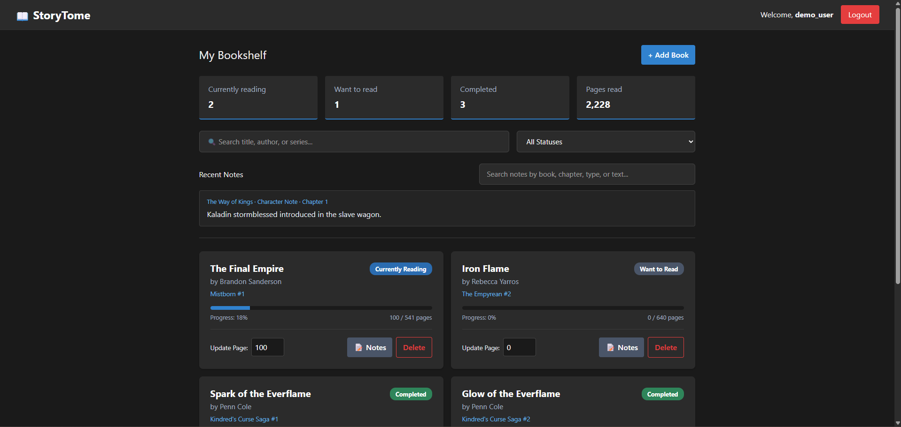
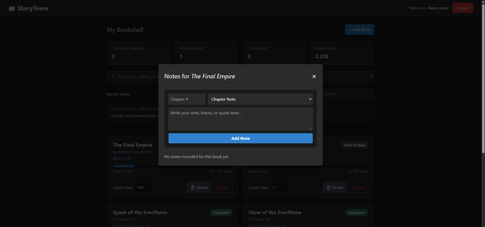
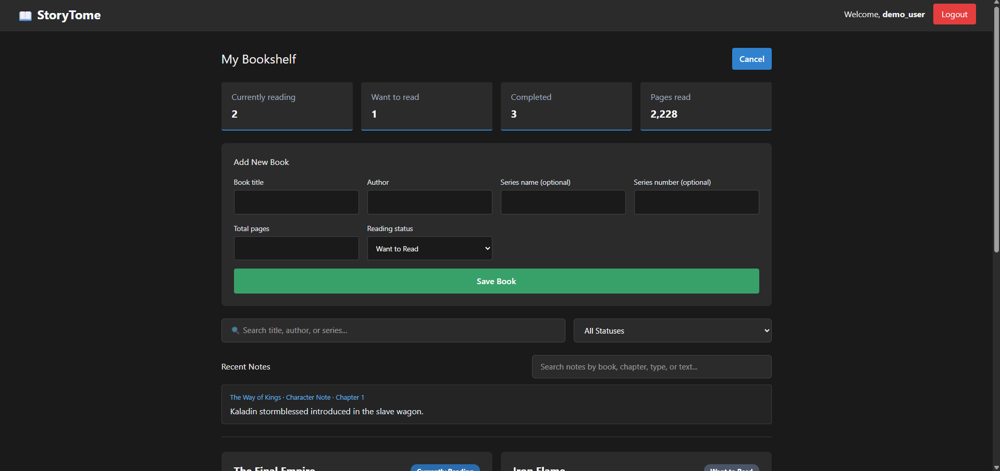
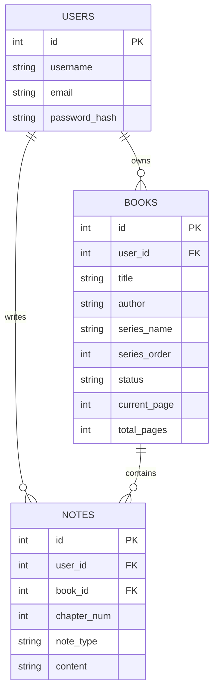

# StoryTome

A private reading companion for readers following long fantasy and fiction series. StoryTome organizes a personal bookshelf, tracks page progress, and keeps chapter recaps, character notes, quotes, and theories connected to the book they belong to.

## Project Overview

High-level shelf apps are useful for tracking what someone reads, but they are not designed to help readers remember the details of a long series. StoryTome keeps personal annotations alongside each book so readers can revisit their own notes without relying on scattered apps or spoiler-heavy public wikis.

The application supports:

- Personal accounts with password hashing and signed Flask sessions
- A private bookshelf with series order, status, and page-progress tracking
- Search and status filtering for books
- Chapter notes, recaps, character notes, quotes, and theories attached to books
- Searchable recent notes, including search by book, chapter, note type, and content
- Ownership checks on book and note API operations

An AI-powered spoiler-free lore and recap companion is a possible future extension; it is not part of the current implementation.

## Screenshots

Screenshots are stored in the [`screenshots/`](screenshots/) folder.

### Login



### Dashboard



### Notes modal



### Add a book



## Demo Access

There is no public deployment yet. Run the application locally using the setup steps below.

The local seed script creates this development account:

| Username | Password |
|---|---|
| `demo_user` | `password123` |

These credentials are for local review only. Do not use the seeded account or password in a deployed environment.

## Architecture

| Layer | Technology | Responsibility |
|---|---|---|
| Client | React, Vite, React Router | Login and signup, protected dashboard, bookshelf interactions, note search and editing |
| API | Python, Flask, Flask-SQLAlchemy | Session authentication, validation, user-scoped CRUD endpoints, JSON errors |
| Data | SQLAlchemy, SQLite by default, PostgreSQL supported | Users, books, notes, and their relationships |

### Authentication and Request Flow

1. A user signs up or logs in through `/api/auth`.
2. Flask verifies the password hash and establishes a signed, HttpOnly session cookie.
3. The React client sends that cookie with API requests; it does not store a bearer token in localStorage.
4. Protected API routes derive the user identity from the session and only return or mutate records owned by that user.
5. If an API request returns `401`, the client clears its authenticated state and protected navigation returns to login.

The project pitch proposed JWT authentication. This implementation uses Flask sessions instead, which is an allowed option for the assignment and avoids keeping an authentication token in browser localStorage.

### Data Model



## Repository Structure

```text
StoryTome/
├── client/
│   ├── public/
│   └── src/
│       ├── components/    # Navbar and note modal
│       ├── context/       # Authentication provider and hook
│       ├── pages/         # Login, signup, and bookshelf dashboard
│       └── services/      # API fetch helper
└── server/
    ├── instance/          # Local SQLite database (git-ignored)
    ├── migrations/        # Alembic configuration and revisions
    ├── models/            # User, Book, and Note models
    ├── routes/            # Auth, book, and note endpoints
    └── tests/             # API auth, CRUD, and ownership tests
```

## Local Quick Start

### Prerequisites

- Python 3.13
- Pipenv
- Node.js and npm

### 1. Configure and start the API

From the repository root in PowerShell:

```powershell
cd server
pipenv install
Copy-Item .env.example .env
pipenv shell
```

Set `SECRET_KEY` in `server/.env` to a unique random value, then enter the Pipenv shell in that terminal. Run the remaining backend commands from this active shell. The default database is SQLite at `server/instance/storytome.db`; set `DATABASE_URI` in `.env` if you want to use another supported SQLAlchemy database.

For a fresh database, run the migration and seed the local demo account:

```powershell
flask --app app db upgrade
python seed.py
flask --app app run --port 5555
```

If the database already has tables created with `db.create_all()` or an earlier seed script, back it up and inspect its schema before applying migrations. When its schema matches the initial revision, mark it with `flask --app app db stamp head` instead of running `db upgrade` against those existing tables.

### 2. Start the client

Open a second terminal at the repository root:

```powershell
cd client
npm install
npm run dev
```

Open the local URL printed by Vite, usually `http://localhost:5173`. Vite forwards `/api` requests to Flask on port `5555`.

## API Reference

Authentication endpoints:

| Method | Route | Purpose |
|---|---|---|
| `POST` | `/api/auth/signup` | Create an account and start a session |
| `POST` | `/api/auth/login` | Verify credentials and start a session |
| `DELETE` | `/api/auth/logout` | End the active session |
| `GET` | `/api/auth/me` | Return the signed-in user |

Authenticated book endpoints:

| Method | Route | Purpose |
|---|---|---|
| `GET`, `POST` | `/api/books` | List the current user's books or create a book |
| `GET`, `PATCH`, `DELETE` | `/api/books/<id>` | Read, update, or delete an owned book |

Authenticated note endpoints:

| Method | Route | Purpose |
|---|---|---|
| `GET`, `POST` | `/api/notes` | List owned notes or create a note for an owned book; accepts optional `book_id` on GET |
| `GET`, `PATCH`, `DELETE` | `/api/notes/<id>` | Read, update, or delete an owned note |
| `GET` | `/api/health` | Check API health |

Handled HTTP and database errors return JSON with an appropriate HTTP status. Resource routes check ownership on reads and writes; clients cannot assign records to another user by submitting a `user_id`.

## Verification

From `server/`, activate the Pipenv environment and run the backend tests:

```powershell
pipenv shell
python -m unittest discover -s tests -v
```

Run client checks from `client/`:

```powershell
npm run lint
npm run build
```

The backend tests use an isolated in-memory SQLite database and cover session authentication, resource CRUD, and cross-user access restrictions.

## Configuration and Deployment Notes

| Variable | Purpose | Default |
|---|---|---|
| `APP_ENV` | Set to `production` to require an explicit secret and enable secure session cookies | `development` |
| `SECRET_KEY` | Signs Flask session cookies; required in production | Development-only fallback |
| `DATABASE_URI` | SQLAlchemy database connection | Local SQLite |
| `CLIENT_ORIGINS` | Comma-separated allowed browser origins for cross-origin hosting | Local Vite origins |
| `VITE_API_BASE_URL` | Client API base path or URL | `/api` |

Keep `.env` files and secrets out of Git. For production, serve over HTTPS, provide a strong `SECRET_KEY`, configure a persistent `DATABASE_URI`, and run the Flask API behind a production WSGI server. From `server/`, activate Pipenv and start Gunicorn with:

```powershell
pipenv shell
gunicorn -w 2 -b 0.0.0.0:5555 app:app
```

Prefer hosting the frontend and API on the same site; CORS settings alone do not enable cross-site session cookies.

No public deployment URL is configured yet. Add verified frontend and API links here after deployment rather than pointing reviewers to a placeholder.

## Project Value

StoryTome focuses on the gap between a reading-status tracker and a detailed personal annotation system. By binding private notes to a reader's books and chapters, it supports series organization, progress tracking, and spoiler-conscious recall in one place.
